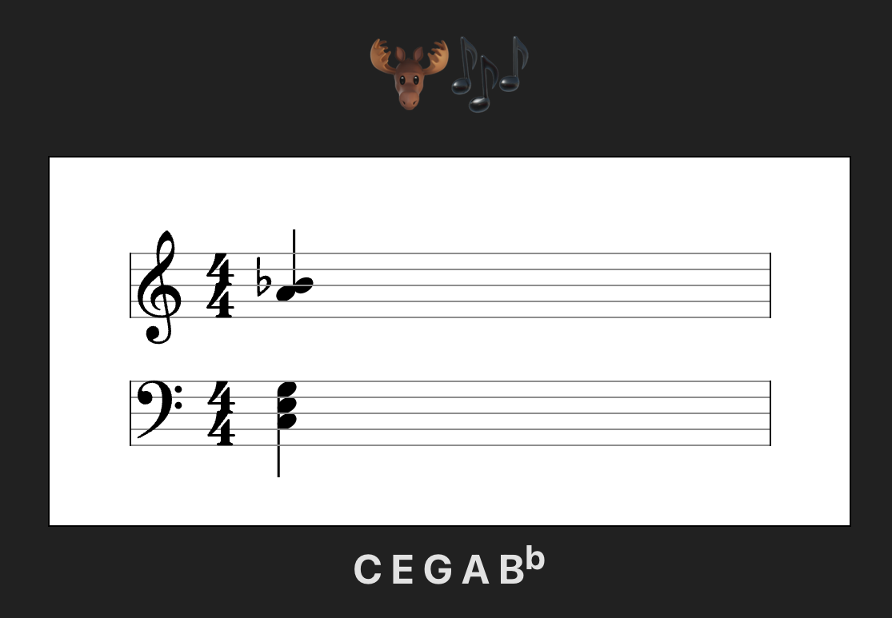

# Music Moose 🫎🎶 - Visualize MIDI Input in the Browser



This project is a MIDI visualizer built using React, VexFlow, and Web MIDI API. It listens for incoming MIDI notes from a connected MIDI device, processes them, and displays them on a musical staff using VexFlow. The notes are shown in real-time as you play them on a MIDI keyboard, with separate staves for treble and bass clefs.

### Features:
- **MIDI Input:** The app listens for MIDI input from connected MIDI devices.
- **Real-Time Note Display:** Notes are dynamically displayed on a musical staff using VexFlow.
- **Note Sorting:** The notes are sorted by octave and pitch to ensure proper staff placement.
- **Web MIDI Support:** The app uses the Web MIDI API to communicate with MIDI devices, making it compatible with most modern browsers.

---


## Prerequisites:

Make sure you have the following installed on your machine:

- **Node.js** (v14.x or higher)
- **Yarn** (for package management)

---

## Installation and Setup:

1. **Clone the Repository**:
```
git clone https://github.com/nielsdejong/music-moose.git cd midi-visualizer
```

2. **Install Dependencies**:
If you haven't already installed Yarn, you can do so by following the instructions [here](https://yarnpkg.com/getting-started/install).

Once Yarn is installed, run the following command in the project directory:
```
yarn install
```

3. **Run the Development Server**:
To start the app in development mode, run:
```
yarn start
```

This will start the application on `http://localhost:5173`.

4. **Open the Application**:
Open your browser and navigate to `http://localhost:5173`. If you have a MIDI device connected, you should see the notes being rendered on the screen as you play.

---

## Usage:

1. **Connect a MIDI Device:**
Make sure your MIDI device (keyboard, controller, etc.) is connected to your computer.

2. **Start Playing:**
As you press and release keys on your MIDI device, the corresponding notes will be displayed on the musical staff in real-time.

3. **Visualizing Notes:**
- **Treble Clef**: Notes with octaves 4 or higher are displayed on the treble clef.
- **Bass Clef**: Notes with octaves 3 or lower are displayed on the bass clef.

The notes are visualized using VexFlow, which renders the musical notation in a standard staff.

---

## Troubleshooting:

- **MIDI Support**: Ensure that your browser supports the Web MIDI API. Most modern browsers (Chrome, Edge, etc.) support this API, but some (like Safari) might require enabling certain settings.

- **No MIDI Device Detected**: If no MIDI devices are detected, make sure your device is correctly connected and that you have granted permission to the browser to access MIDI devices.

- **Error Messages**: If there are any errors related to Web MIDI or rendering, check the browser's developer console for additional details.

---

